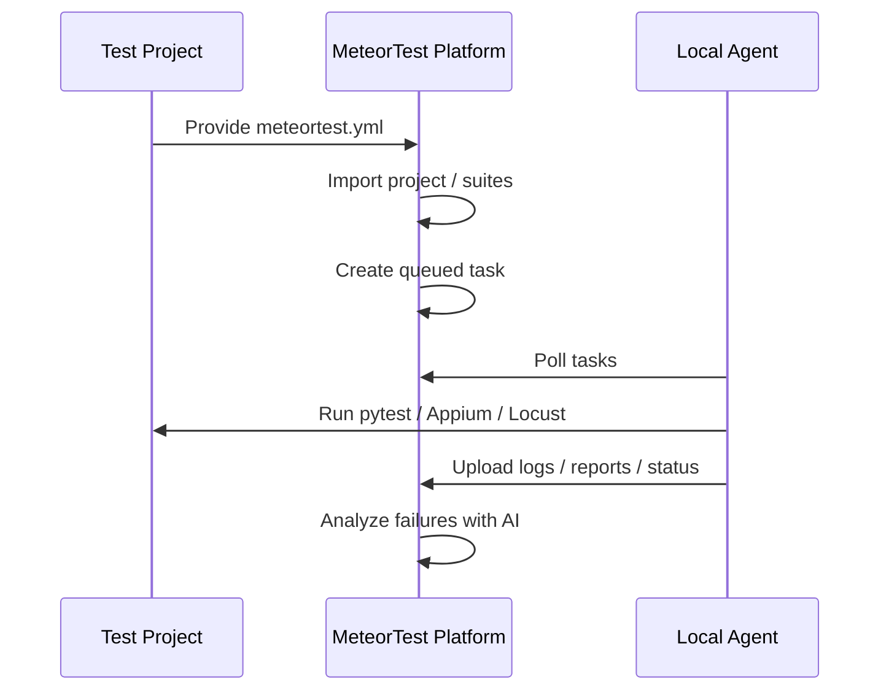
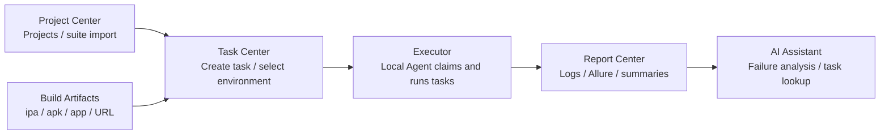
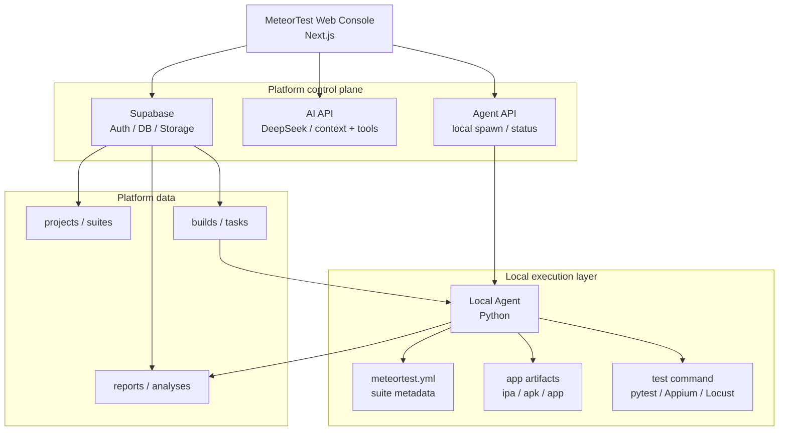
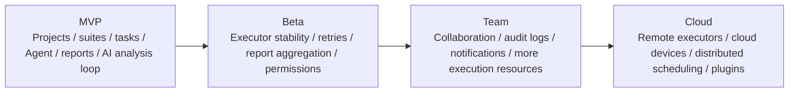

# MeteorTest

<p align="center">
  <strong>An automation testing platform for multiple projects, suites, local executors, and AI-assisted analysis</strong>
</p>

<p align="center">
  
  
  
  
  <br />
  <a href="https://github.com/JunchenMeteor/iOS-Automation-Framework"></a>
  <a href="https://github.com/JunchenMeteor/MeteorTest/issues"></a>
  <a href="#roadmap"></a>
  <br />
  <a href="README.md"></a>
  <a href="README.zh-CN.md"></a>
</p>

MeteorTest is a general-purpose automation testing platform for managing multiple test projects, importing test suites, creating test tasks, scheduling local executors, collecting reports, and using AI to assist with result and failure analysis.

`MeteorTest` is the product and engineering name. `meteortest.yml` is the test-project integration contract used by automation repositories.

## Table of Contents

- [Maintainer](#maintainer)
- [Background](#background)
- [Core Capabilities](#core-capabilities)
- [Capability Overview](#capability-overview)
- [System Architecture](#system-architecture)
- [Project Structure](#project-structure)
- [Start the Web Console Locally](#start-the-web-console-locally)
- [Connect a Test Project](#connect-a-test-project)
- [Run the Local Agent](#run-the-local-agent)
- [Recommended Validation Flow](#recommended-validation-flow)
- [Validation and CI](#validation-and-ci)
- [Cost Notes](#cost-notes)
- [Roadmap](#roadmap)

Additional docs:

- [Platform architecture and roadmap](docs/platform-architecture-roadmap.md)
- [Private Agent preview loop](docs/private-agent-preview-loop.md)

## Maintainer

MeteorTest is initiated and maintained by **Meteor**.

The project focuses on client-side engineering quality, automation testing, iOS engineering systems, test platform engineering, and AI-assisted development. The goal is not to build a dashboard that only displays data, but to connect test projects, tasks, executors, reports, and AI analysis into a practical execution loop.

## Background

Many automation projects can run successfully at the beginning, but later run into recurring problems:

- Test scripts are scattered across repositories without a unified entry point.
- Test tasks are triggered manually, making execution history and reports hard to track.
- App artifacts, environments, and test suites are not linked through structured data.
- Local Macs, devices, and simulators are not visible to a central platform.
- Failure logs keep growing, while root-cause analysis still depends on manual log reading.
- AI can help analyze issues, but without platform context, task creation, and report access, it remains limited to chat.

MeteorTest uses the platform as the control plane and data layer, while actual test execution stays in a local Local Agent. Test projects expose a standard contract file, and the platform avoids coupling itself to project-specific test code.



## Core Capabilities

- Project management: bind each product or app to one or more automation repositories.
- Suite management: import API, UI, performance, and other suites from `meteortest.yml`.
- Build artifact management: register `.ipa`, `.apk`, `.app`, or other build URLs.
- Task scheduling: create tasks from the Web console or AI assistant; agents poll and execute them.
- Executor management: view Local Agent status, capability tags, heartbeats, and launch entry points.
- Report center: record logs, Allure artifacts, execution summaries, and task status.
- AI assistant: support contextual Q&A, project creation, task creation, task detail lookup, and result analysis.
- Settings: configure platform name, UI language, theme, information density, AI model, default environment, notification strategy, and Agent launch behavior.
- Account access: supports username or phone password sign-in, profile management, feedback, and viewer/operator/admin role boundaries.

## Capability Overview

The MVP is organized around one complete testing loop rather than a flat list of screens:



Current capabilities around this loop:

- **Project Center**: create projects, view project details, and import `meteortest.yml` suites.
- **Build Artifacts**: manage `.ipa`, `.apk`, `.app`, and build URLs.
- **Task Center**: create tasks and link suites, environments, and build artifacts.
- **Executors**: view Local Agent status, capability tags, heartbeats, and launch entry points.
- **Report Center**: view execution logs, Allure artifacts, summaries, and task results.
- **AI Assistant**: create tasks, query task details, analyze results, and answer contextual questions.
- **Account access**: username or phone password sign-in, profile, feedback, and role boundaries.

Supporting management capabilities:

- **Dashboard**: platform overview and key entry points.
- **Settings**: platform name, UI language, theme, information density, AI model, default environment, notification strategy, and Agent launch behavior.

## System Architecture



Responsibility boundaries:

- `MeteorTest`: the platform center for tasks, data, reports, AI, and executor status.
- `Local Agent`: the executor that claims tasks, prepares artifacts, runs commands, and writes results back.
- Test projects: own test code and `meteortest.yml`, for example [`iOS-Automation-Framework`](https://github.com/JunchenMeteor/iOS-Automation-Framework).
- App artifacts: the tested targets, such as `.ipa`, `.apk`, `.app`, or internal build links.

## Project Structure

```text
MeteorTest/
├── apps/web/
├── agent/
├── docs/
├── packages/shared/
├── supabase/migrations/
├── DESIGN.md
└── PROGRESS.md
```

By responsibility:

- `apps/web/`: Next.js Web console, including pages, components, API routes, and Supabase access.
- `agent/`: Python Local Agent for polling tasks, running suites, collecting logs, and reporting results.
- `docs/`: test-project integration examples, especially the `meteortest.yml` contract.
- `packages/shared/`: shared TypeScript protocol types.
- `supabase/migrations/`: ordered database migration SQL files.
- `DESIGN.md`: product boundaries, architecture design, and long-term direction.
- `PROGRESS.md`: current implementation progress and planned work.

## Start the Web Console Locally

### 1. Install dependencies

```bash
cd apps/web
npm install
```

### 2. Create a Supabase project

Create a new project in the Supabase console, then run these migrations in order in the SQL Editor:

```text
supabase/migrations/001_init.sql
supabase/migrations/002_app_builds.sql
supabase/migrations/003_constraints.sql
```

If the Agent needs to upload logs and zipped Allure results, create a Storage bucket, for example:

```text
test-artifacts
```

During the MVP stage, a public bucket can make report links easier to open from the Web console. For production use, switch to a private bucket with signed URLs.

### 3. Configure environment variables

```bash
cd apps/web
cp .env.local.example .env.local
```

Fill in:

```text
NEXT_PUBLIC_SUPABASE_URL=https://your-project.supabase.co
NEXT_PUBLIC_SUPABASE_ANON_KEY=your-supabase-anon-key
DEEPSEEK_API_KEY=your-deepseek-api-key
```

`DEEPSEEK_API_KEY` is optional. Without it, the AI assistant is unavailable, but projects, tasks, reports, and executor pages can still be developed and tested.

For public Web previews, configure these values in the deployment provider's protected environment settings instead of committing `.env.local`. Keep `SUPABASE_SERVICE_ROLE_KEY`, `DEEPSEEK_API_KEY`, local repository paths, and Local Agent runtime settings server-only or private. A public preview should expose the Web console first; connected execution by a private Local Agent is a separate rollout step.

### 4. Start the Web console

```bash
cd apps/web
npm run dev
```

Open:

```text
http://127.0.0.1:3000
```

If real Supabase settings are missing, the page cannot fully connect to the database. After updating `.env.local`, restart `npm run dev`.

## Connect a Test Project

A test project should provide `meteortest.yml` at its repository root. See:

```text
docs/meteortest.example.yml
```

Minimum structure:

```yaml
project:
  key: yunlu-ios
  name: Yunlu Mall iOS

suites:
  - id: api_smoke
    name: API smoke test
    type: api
    command: python -m pytest API_Automation/cases -v --alluredir=Reports/platform/{task_id}/allure-results
    requires:
      - python
      - pytest
    report:
      allure: true
```

Suite import supports `id`, `key`, and `suite_key` as compatible suite identifiers.

When a suite command starts with `python` or `python3`, the Local Agent treats the test repository as the runtime owner. It resolves the Python executable in this order:

1. `parameters.python_executable` from the task.
2. `METEORTEST_TEST_PYTHON` from the Agent environment.
3. `.venv` or `venv` inside the test repository.
4. The original `python` or `python3` command if no project-specific runtime is found.

This keeps platform execution isolated from the Agent's own Python environment. For Windows test repositories, prefer a project-local virtual environment so pytest plugins such as `pytest-xdist`, `pytest-rerunfailures`, and `allure-pytest` are resolved consistently.

## Run the Local Agent

### 1. Install Agent dependencies

```bash
python -m pip install -r agent/requirements.txt
```

### 2. Prepare configuration

```bash
cd agent
cp config.example.yaml config.yaml
```

Important fields:

```yaml
platform:
  mode: local        # local or supabase
  local_task_store: .meteortest-agent/tasks.json
  supabase_url: https://your-project.supabase.co
  supabase_service_role_key_env: SUPABASE_SERVICE_ROLE_KEY

repositories:
  - key: yunlu-ios
    path: ../iOS-Automation-Framework
    contract: meteortest.yml

artifacts:
  local_output_root: .meteortest-agent/artifacts
  supabase_bucket: test-artifacts
```

Supabase mode requires:

```bash
export SUPABASE_SERVICE_ROLE_KEY=your-service-role-key
export SUPABASE_ARTIFACT_BUCKET=test-artifacts
```

Windows PowerShell:

```powershell
$env:SUPABASE_SERVICE_ROLE_KEY="your-service-role-key"
$env:SUPABASE_ARTIFACT_BUCKET="test-artifacts"
```

### 3. Start the Agent

```bash
python -m agent.agent --config agent/config.yaml --interval 10
```

The Agent will:

- Register or update the executor.
- Poll queued tasks.
- Lock tasks and move them to running.
- Download the app build attached to a task.
- Run the suite command.
- Write back tasks, reports, and AI analysis records.

The Web executor page also shows Local Agent status and provides a launch entry point. The Settings page can control whether the Agent starts automatically when the executor page is opened.

Do not expose the Local Agent directly on the public internet. For public Web access, the Agent should run privately and poll the platform backend with scoped credentials.

## Public Web Preview Deployment

MeteorTest Web needs an application host that can run Next.js server routes. GitHub Pages is not enough for this app because routes such as `/api/tasks`, `/api/projects`, and `/api/ai/chat` require a server runtime.

Follow this order:

1. Choose a host such as Vercel, Netlify, Cloudflare Workers/Pages with a server runtime, or a controlled server.
2. Create an isolated preview Supabase project or schema and run the migrations in `supabase/migrations/`.
3. Configure provider-managed environment variables for `NEXT_PUBLIC_SUPABASE_URL`, `NEXT_PUBLIC_SUPABASE_ANON_KEY`, `SUPABASE_SERVICE_ROLE_KEY`, and optional `DEEPSEEK_API_KEY`.
4. Keep Local Agent paths and machine-local runtime variables out of the public Web deployment.
5. Deploy `apps/web` with Node.js 22, `npm ci`, and `npm run build`.
6. Smoke-check all public routes and confirm no secrets, local paths, or Local Agent endpoints are exposed.
7. Treat private Agent polling and public connected execution as later steps after safety and access controls are reviewed.

The detailed runbook lives in `apps/web/README.md`.

For Vercel-specific deployment steps, see:

```text
docs/vercel-public-preview.md
```

## Recommended Validation Flow

1. Run Supabase migrations.
2. Start the Web console.
3. Create a project, for example `yunlu-ios`.
4. Open the project detail page, paste the test project's `meteortest.yml`, and import suites.
5. Register an `.ipa`, `.apk`, `.app`, or build URL on the Builds page.
6. Open the Executors page and confirm the Local Agent is running.
7. Create a task from the Tasks page or AI assistant, selecting project, suite, environment, and build artifact.
8. Wait for the Agent to execute it.
9. Open task details to inspect status, logs, Allure artifacts, and AI analysis.

## Validation and CI

This repository includes GitHub Actions CI:

```text
.github/workflows/ci.yml
```

Pull requests run:

```bash
cd apps/web
npm ci
npm run lint
npm run build
```

And:

```bash
python -m pip install -r agent/requirements.txt
python -m compileall agent
python -m pytest agent/tests -q
```

Local manual validation:

```bash
python -m pytest agent/tests -q
python -m compileall agent
cd apps/web
npm run lint
npm run build
```

## Cost Notes

The MVP is designed with low operating cost in mind:

- The Web console can be deployed within Vercel's free tier.
- Database and Storage can start on Supabase's free tier.
- iOS UI automation should prefer a local Mac Agent first, without depending on cloud devices.
- AI usage is pay-as-you-go; triggering analysis only for failed or timeout tasks is recommended.

Cost areas to watch:

- Storage size for reports and logs.
- Number of AI analysis calls and the amount of log text sent for analysis.
- Cloud devices, dedicated CI runners, and team-level Vercel or Supabase plans.

Cost control suggestions:

- Store report indexes in the database instead of large file bodies.
- Truncate or compress logs before upload, and send only relevant failure snippets to AI analysis.
- Clean up old reports and temporary build artifacts regularly.
- Consider cloud devices and advanced scheduling only after the local Agent loop is stable.

## Roadmap


