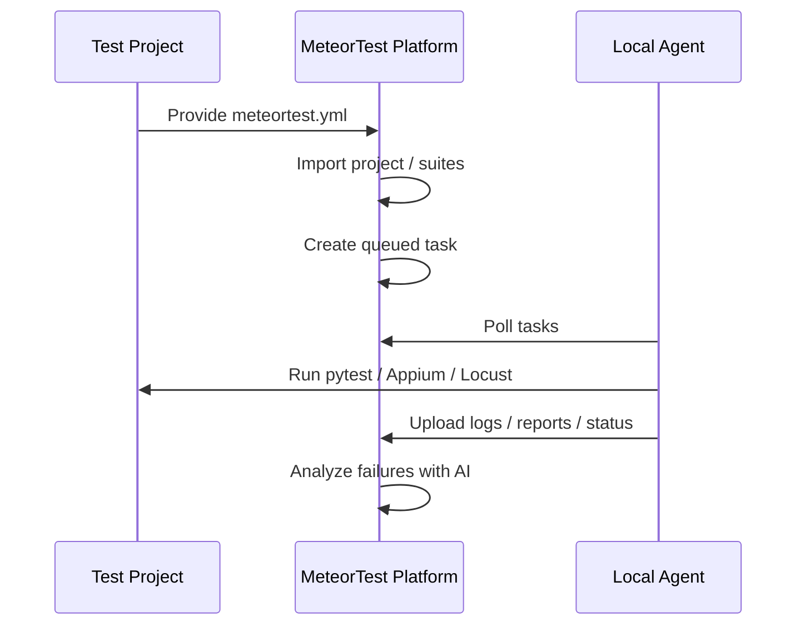
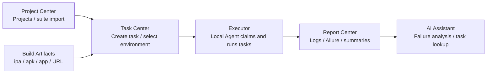
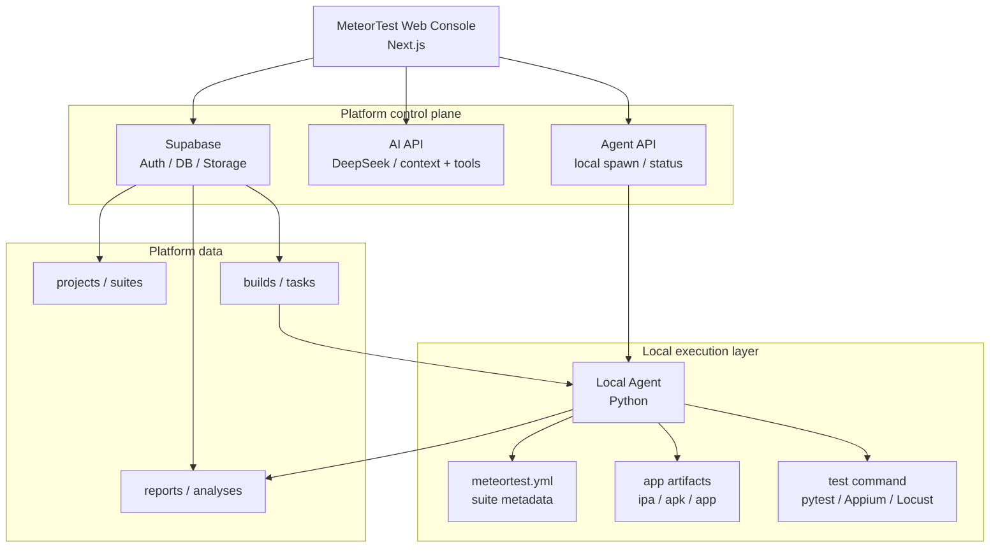
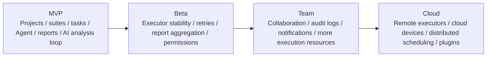

# MeteorTest

<p align="center">
  <strong>An automation testing platform for multiple projects, suites, local executors, and AI-assisted analysis</strong>
</p>

<p align="center">
  
  
  
  
  <br />
  <a href="https://github.com/JunchenMeteor/iOS-Automation-Framework"></a>
  <a href="https://github.com/JunchenMeteor/MeteorTest/issues"></a>
  <a href="#roadmap"></a>
  <br />
  <a href="README.md"></a>
  <a href="README.zh-CN.md"></a>
</p>

MeteorTest is a general-purpose automation testing platform for managing multiple test projects, importing test suites, creating test tasks, scheduling local executors, collecting reports, and using AI to assist with result and failure analysis.

`MeteorTest` is the product and engineering name. `meteortest.yml` is the test-project integration contract used by automation repositories.

## Table of Contents

- [Maintainer](#maintainer)
- [Background](#background)
- [Core Capabilities](#core-capabilities)
- [Capability Overview](#capability-overview)
- [System Architecture](#system-architecture)
- [Project Structure](#project-structure)
- [Start the Web Console Locally](#start-the-web-console-locally)
- [Connect a Test Project](#connect-a-test-project)
- [Run the Local Agent](#run-the-local-agent)
- [Recommended Validation Flow](#recommended-validation-flow)
- [Validation and CI](#validation-and-ci)
- [Cost Notes](#cost-notes)
- [Roadmap](#roadmap)

Documentation entry:

- [Documentation index](docs/README.md)
- [Current progress index](PROGRESS.md)
- [Quality and AI capability roadmap](docs/quality-ai-capability-roadmap.md)

## Maintainer

MeteorTest is initiated and maintained by **Meteor**.

The project focuses on client-side engineering quality, automation testing, iOS engineering systems, test platform engineering, and AI-assisted development. The goal is not to build a dashboard that only displays data, but to connect test projects, tasks, executors, reports, and AI analysis into a practical execution loop.

## Background

Many automation projects can run successfully at the beginning, but later run into recurring problems:

- Test scripts are scattered across repositories without a unified entry point.
- Test tasks are triggered manually, making execution history and reports hard to track.
- App artifacts, environments, and test suites are not linked through structured data.
- Local Macs, devices, and simulators are not visible to a central platform.
- Failure logs keep growing, while root-cause analysis still depends on manual log reading.
- AI can help analyze issues, but without platform context, task creation, and report access, it remains limited to chat.

MeteorTest uses the platform as the control plane and data layer, while actual test execution stays in a local Local Agent. Test projects expose a standard contract file, and the platform avoids coupling itself to project-specific test code.



## Core Capabilities

- Project management: bind each product or app to one or more automation repositories.
- Suite management: import API, UI, performance, and other suites from `meteortest.yml`.
- Build artifact management: register `.ipa`, `.apk`, `.app`, or other build URLs.
- Task scheduling: create tasks from the Web console or AI assistant; agents poll and execute them.
- Executor management: view Local Agent status, capability tags, heartbeats, and launch entry points.
- Report center: record logs, Allure artifacts, execution summaries, and task status.
- AI assistant: support contextual Q&A, project creation, task creation, task detail lookup, and result analysis.
- Settings: configure platform name, UI language, theme, information density, AI model, default environment, notification strategy, and Agent launch behavior.
- Account access: supports username or phone password sign-in, profile management, feedback, and viewer/operator/admin role boundaries.

## Capability Overview

The MVP is organized around one complete testing loop rather than a flat list of screens:



Current capabilities around this loop:

- **Project Center**: create projects, view project details, and import `meteortest.yml` suites.
- **Build Artifacts**: manage `.ipa`, `.apk`, `.app`, and build URLs.
- **Task Center**: create tasks and link suites, environments, and build artifacts.
- **Executors**: view Local Agent status, capability tags, heartbeats, and launch entry points.
- **Report Center**: view execution logs, Allure artifacts, summaries, and task results.
- **AI Assistant**: create tasks, query task details, analyze results, and answer contextual questions.
- **Account access**: username or phone password sign-in, profile, feedback, and role boundaries.

Supporting management capabilities:

- **Dashboard**: platform overview and key entry points.
- **Settings**: platform name, UI language, theme, information density, AI model, default environment, notification strategy, and Agent launch behavior.

## System Architecture



Responsibility boundaries:

- `MeteorTest`: the platform center for tasks, data, reports, AI, and executor status.
- `Local Agent`: the executor that claims tasks, prepares artifacts, runs commands, and writes results back.
- Test projects: own test code and `meteortest.yml`, for example [`iOS-Automation-Framework`](https://github.com/JunchenMeteor/iOS-Automation-Framework).
- App artifacts: the tested targets, such as `.ipa`, `.apk`, `.app`, or internal build links.

## Project Structure

```text
MeteorTest/
├── apps/web/
├── agent/
├── docs/
├── packages/shared/
├── supabase/migrations/
├── DESIGN.md
└── PROGRESS.md
```

By responsibility:

- `apps/web/`: Next.js Web console, including pages, components, API routes, and Supabase access.
- `agent/`: Python Local Agent for polling tasks, running suites, collecting logs, and reporting results.
- `docs/`: documentation index, roadmaps, deployment runbooks, Agent operations, data-safety notes, and the test-project contract.
- `packages/shared/`: shared TypeScript protocol types.
- `supabase/migrations/`: ordered database migration SQL files.
- `DESIGN.md`: product boundaries, architecture design, and long-term direction.
- `PROGRESS.md`: current progress index; detailed execution plans live in focused `docs/` files.

## Start the Web Console Locally

```bash
cd apps/web
npm ci
cp .env.local.example .env.local
npm run dev:local
```

Open:

```text
http://127.0.0.1:3000
```

`.env.local` must contain Supabase URL, Anon Key, Service Role Key, and optional `DEEPSEEK_API_KEY`. See `apps/web/README.md` for Web environment notes and `docs/supabase-account-data-runbook.md` for SQL execution order.

## Connect a Test Project

A test project should provide `meteortest.yml` at its repository root. Contract example:

```text
docs/meteortest.example.yml
```

MeteorTest uses this file to identify project key, test scopes, commands, dependencies, and report artifacts. Runtime resolution, Allure output, and Agent execution details live in `agent/README.md` and `docs/private-agent-preview-loop.md`.

## Run the Local Agent

```bash
python -m pip install -r agent/requirements.txt
cp agent/config.example.yaml agent/config.yaml
./scripts/start-local-agent.sh
```

To keep the Agent running on macOS, install the user-level `launchd` service:

```bash
./scripts/install-local-agent-launchd.sh
```

Full configuration, heartbeat, task check interval, logs, and troubleshooting live in `docs/local-agent-operations.md`. For public Web use, keep the Agent private and let it poll the backend with scoped credentials.

## Public Web Preview Deployment

MeteorTest Web needs a host that can run Next.js server routes. GitHub Pages is not enough because `/api/*` requires a server runtime.

Public preview deployment steps live in `docs/vercel-public-preview.md`. Public Web plus private Agent validation lives in `docs/private-agent-preview-loop.md`.

## Recommended Validation Flow

1. Run Supabase migrations.
2. Start the Web console.
3. Create a project, for example `yunlu-ios`.
4. Open the project detail page, paste the test project's `meteortest.yml`, and import suites.
5. Register an `.ipa`, `.apk`, `.app`, or build URL on the Builds page.
6. Open the Executors page and confirm the Local Agent is running.
7. Create a task from the Tasks page or AI assistant, selecting project, suite, environment, and build artifact.
8. Wait for the Agent to execute it.
9. Open task details to inspect status, logs, Allure artifacts, and AI analysis.

## Validation and CI

This repository includes GitHub Actions CI:

```text
.github/workflows/ci.yml
```

Pull requests run:

```bash
cd apps/web
npm ci
npm run lint
npm run build
```

And:

```bash
python -m pip install -r agent/requirements.txt
python -m compileall agent
python -m pytest agent/tests -q
```

Local manual validation:

```bash
python -m pytest agent/tests -q
python -m compileall agent
cd apps/web
npm run lint
npm run build
```

## Cost Notes

The MVP is designed with low operating cost in mind:

- The Web console can be deployed within Vercel's free tier.
- Database and Storage can start on Supabase's free tier.
- iOS UI automation should prefer a local Mac Agent first, without depending on cloud devices.
- AI usage is pay-as-you-go; triggering analysis only for failed or timeout tasks is recommended.

Cost areas to watch:

- Storage size for reports and logs.
- Number of AI analysis calls and the amount of log text sent for analysis.
- Cloud devices, dedicated CI runners, and team-level Vercel or Supabase plans.

Cost control suggestions:

- Store report indexes in the database instead of large file bodies.
- Truncate or compress logs before upload, and send only relevant failure snippets to AI analysis.
- Clean up old reports and temporary build artifacts regularly.
- Consider cloud devices and advanced scheduling only after the local Agent loop is stable.

## Roadmap


