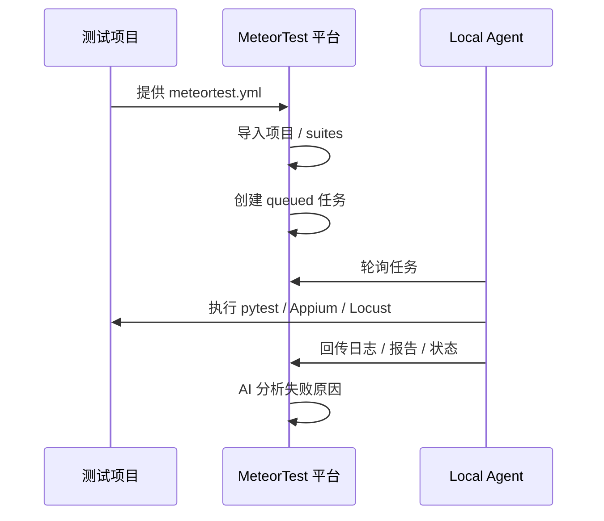
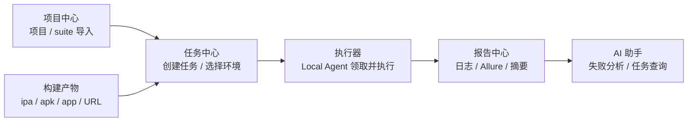
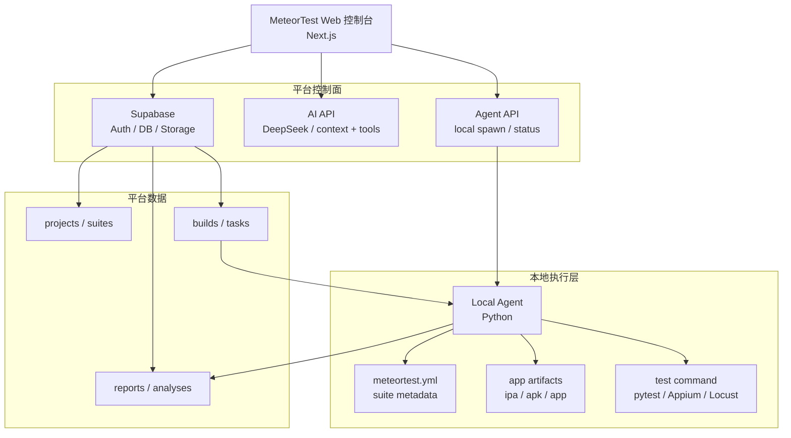
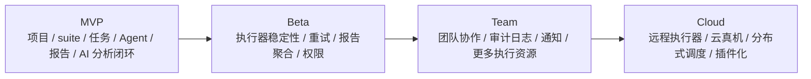

# MeteorTest

<p align="center">
  <strong>面向多项目、多套件、本地执行器和 AI 辅助分析的自动化测试平台</strong>
</p>

<p align="center">
  
  
  
  
  <br />
  <a href="https://github.com/JunchenMeteor/iOS-Automation-Framework"></a>
  <a href="https://github.com/JunchenMeteor/MeteorTest/issues"></a>
  <a href="#路线规划"></a>
  <br />
  <a href="README.md"></a>
  <a href="README.zh-CN.md"></a>
</p>

MeteorTest 是一个通用自动化测试平台，用来管理多个测试项目、导入测试套件、创建测试任务、调度本地执行器、收集测试报告，并通过 AI 辅助分析测试结果和失败原因。

当前产品中文名是 **星流测试台**。`MeteorTest` 是工程和产品英文名。`meteortest.yml` 是自动化测试仓库接入平台时使用的测试项目协议文件。

## 目录

- [维护者](#维护者)
- [背景](#背景)
- [核心能力](#核心能力)
- [能力概览](#能力概览)
- [系统架构](#系统架构)
- [项目结构](#项目结构)
- [本地启动 Web 控制台](#本地启动-web-控制台)
- [接入测试项目](#接入测试项目)
- [运行 Local Agent](#运行-local-agent)
- [推荐验证流程](#推荐验证流程)
- [验证和 CI](#验证和-ci)
- [成本说明](#成本说明)
- [路线规划](#路线规划)

## 维护者

MeteorTest 由 **流星（Meteor）** 发起和维护。

这个项目关注客户端工程质量、自动化测试、iOS 工程体系、测试平台化和 AI 辅助研发。目标不是做一个只展示数据的后台页面，而是把测试工程、测试任务、执行器、报告和 AI 分析连接成一个可以真实落地的执行闭环。

## 背景

很多自动化测试项目一开始可以顺利运行，但后续会遇到一些反复出现的问题：

- 测试脚本散落在不同仓库，缺少统一入口。
- 测试任务靠人工命令触发，执行记录和报告难以追踪。
- App 构建产物、测试环境、测试套件之间没有结构化关联。
- 本地 Mac、真机、模拟器等执行资源无法被平台感知。
- 失败日志持续增长，但定位原因仍然依赖人工阅读日志。
- AI 可以辅助分析问题，但如果不能读取平台上下文、不能创建任务、不能查看报告，就只能停留在聊天层面。

MeteorTest 的设计思路是：平台负责控制面和数据层，真实测试执行留在本地 Local Agent；测试项目通过标准协议文件暴露能力，平台不直接耦合具体项目的测试代码。



## 核心能力

- 项目管理：将每个产品或 App 绑定到一个或多个自动化测试仓库。
- 套件管理：通过 `meteortest.yml` 导入 API、UI、性能等 suite。
- 构建产物管理：登记 `.ipa`、`.apk`、`.app` 或其他构建 URL。
- 任务调度：从 Web 控制台或 AI 助手创建任务，Agent 轮询并执行。
- 执行器管理：查看 Local Agent 在线状态、能力标签、心跳和启动入口。
- 报告中心：记录日志、Allure 产物、执行摘要和任务状态。
- AI 助手：支持上下文问答、项目创建、任务创建、任务详情查询和结果分析。
- 设置中心：配置平台名称、AI 模型、默认环境、通知策略和 Agent 启动策略。

## 能力概览

MVP 围绕一条完整测试闭环组织，而不是平铺功能页面：



围绕这条闭环，当前能力包括：

- **项目中心**：创建项目、查看项目详情、导入 `meteortest.yml` suites。
- **构建产物**：管理 `.ipa`、`.apk`、`.app` 和构建 URL。
- **任务中心**：创建任务，并关联 suite、环境和构建产物。
- **执行器**：查看 Local Agent 状态、能力标签、心跳和启动入口。
- **报告中心**：查看执行日志、Allure 产物、执行摘要和任务结果。
- **AI 助手**：创建任务、查询任务详情、分析结果和进行上下文问答。

辅助管理能力：

- **Dashboard**：平台概览和关键入口。
- **设置页**：平台名称、AI 模型、默认环境、通知策略和 Agent 启动策略。

## 系统架构



职责边界：

- `MeteorTest`：平台中心，负责任务、数据、报告、AI 和执行器状态。
- `Local Agent`：执行器，负责领取任务、准备构建产物、执行命令并回写结果。
- 测试项目：负责测试代码和 `meteortest.yml`，例如 [`iOS-Automation-Framework`](https://github.com/JunchenMeteor/iOS-Automation-Framework)。
- App 构建产物：被测对象，例如 `.ipa`、`.apk`、`.app` 或内部构建链接。

## 项目结构

```text
MeteorTest/
├── apps/web/
├── agent/
├── docs/
├── packages/shared/
├── supabase/migrations/
├── DESIGN.md
└── PROGRESS.md
```

按职责看：

- `apps/web/`：Next.js Web 控制台，包含页面、组件、API routes 和 Supabase 访问。
- `agent/`：Python Local Agent，负责轮询任务、执行 suite、收集日志并回传结果。
- `docs/`：测试项目接入示例，重点是 `meteortest.yml` 协议。
- `packages/shared/`：共享的 TypeScript 协议类型。
- `supabase/migrations/`：按顺序执行的数据库迁移 SQL。
- `DESIGN.md`：产品边界、架构设计和长期方向。
- `PROGRESS.md`：当前实现进度和后续计划。

## 本地启动 Web 控制台

### 1. 安装依赖

```bash
cd apps/web
npm install
```

### 2. 创建 Supabase 项目

在 Supabase 控制台创建新项目，然后在 SQL Editor 中按顺序执行：

```text
supabase/migrations/001_init.sql
supabase/migrations/002_app_builds.sql
supabase/migrations/003_constraints.sql
```

如果 Agent 需要上传日志和 Allure 压缩包，创建一个 Storage bucket，例如：

```text
test-artifacts
```

MVP 阶段可以先使用 public bucket，方便 Web 控制台直接打开报告链接。生产环境应改成私有 bucket，并使用签名 URL。

### 3. 配置环境变量

```bash
cd apps/web
cp .env.local.example .env.local
```

填入：

```text
NEXT_PUBLIC_SUPABASE_URL=https://your-project.supabase.co
NEXT_PUBLIC_SUPABASE_ANON_KEY=your-supabase-anon-key
DEEPSEEK_API_KEY=your-deepseek-api-key
```

`DEEPSEEK_API_KEY` 是可选项。没有它时，AI 助手不可用，但项目、任务、报告和执行器页面仍可开发和调试。

### 4. 启动 Web 控制台

```bash
cd apps/web
npm run dev
```

打开：

```text
http://127.0.0.1:3000
```

如果没有真实 Supabase 配置，页面无法完整连接数据库。更新 `.env.local` 后，需要重启 `npm run dev`。

## 接入测试项目

测试项目需要在仓库根目录提供 `meteortest.yml`。示例见：

```text
docs/meteortest.example.yml
```

最小结构：

```yaml
project:
  key: yunlu-ios
  name: Yunlu Mall iOS

suites:
  - id: api_smoke
    name: API smoke test
    type: api
    command: python -m pytest API_Automation/cases -v --alluredir=Reports/platform/{task_id}/allure-results
    requires:
      - python
      - pytest
    report:
      allure: true
```

导入 suite 时兼容 `id`、`key`、`suite_key` 三种 suite 标识字段。

当 suite command 以 `python` 或 `python3` 开头时，Local Agent 会把测试仓库视为运行时所有者，并按以下顺序解析 Python 可执行文件：

1. 任务中的 `parameters.python_executable`。
2. Agent 环境变量 `METEORTEST_TEST_PYTHON`。
3. 测试仓库内的 `.venv` 或 `venv`。
4. 如果没有找到项目专属运行时，则保留原始 `python` 或 `python3` 命令。

这样可以避免平台 Agent 自己的 Python 环境污染测试仓库。Windows 测试仓库建议使用项目内虚拟环境，确保 `pytest-xdist`、`pytest-rerunfailures`、`allure-pytest` 等插件解析一致。

## 运行 Local Agent

### 1. 安装 Agent 依赖

```bash
python -m pip install -r agent/requirements.txt
```

### 2. 准备配置

```bash
cd agent
cp config.example.yaml config.yaml
```

关键配置：

```yaml
platform:
  mode: local        # local or supabase
  local_task_store: .meteortest-agent/tasks.json
  supabase_url: https://your-project.supabase.co
  supabase_service_role_key_env: SUPABASE_SERVICE_ROLE_KEY

repositories:
  - key: yunlu-ios
    path: ../iOS-Automation-Framework
    contract: meteortest.yml

artifacts:
  local_output_root: .meteortest-agent/artifacts
  supabase_bucket: test-artifacts
```

Supabase 模式需要设置：

```bash
export SUPABASE_SERVICE_ROLE_KEY=your-service-role-key
export SUPABASE_ARTIFACT_BUCKET=test-artifacts
```

Windows PowerShell：

```powershell
$env:SUPABASE_SERVICE_ROLE_KEY="your-service-role-key"
$env:SUPABASE_ARTIFACT_BUCKET="test-artifacts"
```

### 3. 启动 Agent

```bash
python -m agent.agent --config agent/config.yaml --interval 10
```

Agent 会：

- 注册或更新 executor。
- 轮询 queued 任务。
- 锁定任务并置为 running。
- 下载任务关联的 app build。
- 执行 suite command。
- 写回 tasks、reports 和 ai_analyses。

Web 执行器页面也会展示 Local Agent 状态，并提供启动入口。设置页可以控制打开执行器页面时是否自动启动 Agent。

## 推荐验证流程

1. 执行 Supabase 迁移。
2. 启动 Web 控制台。
3. 创建项目，例如 `yunlu-ios`。
4. 打开项目详情，粘贴测试项目的 `meteortest.yml` 并导入 suites。
5. 在 Builds 页面登记 `.ipa`、`.apk`、`.app` 或构建 URL。
6. 打开 Executors 页面，确认 Local Agent 正在运行。
7. 在 Tasks 页面或 AI 助手中创建任务，选择项目、suite、环境和构建产物。
8. 等待 Agent 执行。
9. 打开任务详情，查看状态、日志、Allure 产物和 AI 分析。

## 验证和 CI

本仓库包含 GitHub Actions CI：

```text
.github/workflows/ci.yml
```

Pull request 会运行：

```bash
cd apps/web
npm ci
npm run lint
npm run build
```

以及：

```bash
python -m pip install -r agent/requirements.txt
python -m compileall agent
python -m pytest agent/tests -q
```

本地手动验证：

```bash
python -m pytest agent/tests -q
python -m compileall agent
cd apps/web
npm run lint
npm run build
```

## 成本说明

MVP 按低运行成本设计：

- Web 控制台可以部署在 Vercel 免费额度内。
- 数据库和 Storage 可以先使用 Supabase 免费额度。
- iOS UI 自动化优先使用本地 Mac Agent，不依赖云真机。
- AI 能力按量调用，建议只对 failed 或 timeout 任务触发分析。

需要关注的成本来源：

- 报告和日志的 Storage 体积。
- AI 分析调用次数，以及发送给 AI 的日志文本长度。
- 云真机、专用 CI runner、团队级 Vercel 或 Supabase 套餐。

成本控制建议：

- 数据库保存报告索引，不保存大文件正文。
- 日志上传前截断或压缩，AI 分析只发送相关失败片段。
- 定期清理旧报告和临时构建产物。
- 本地 Agent 闭环稳定后，再考虑云真机和高级调度。

## 路线规划


